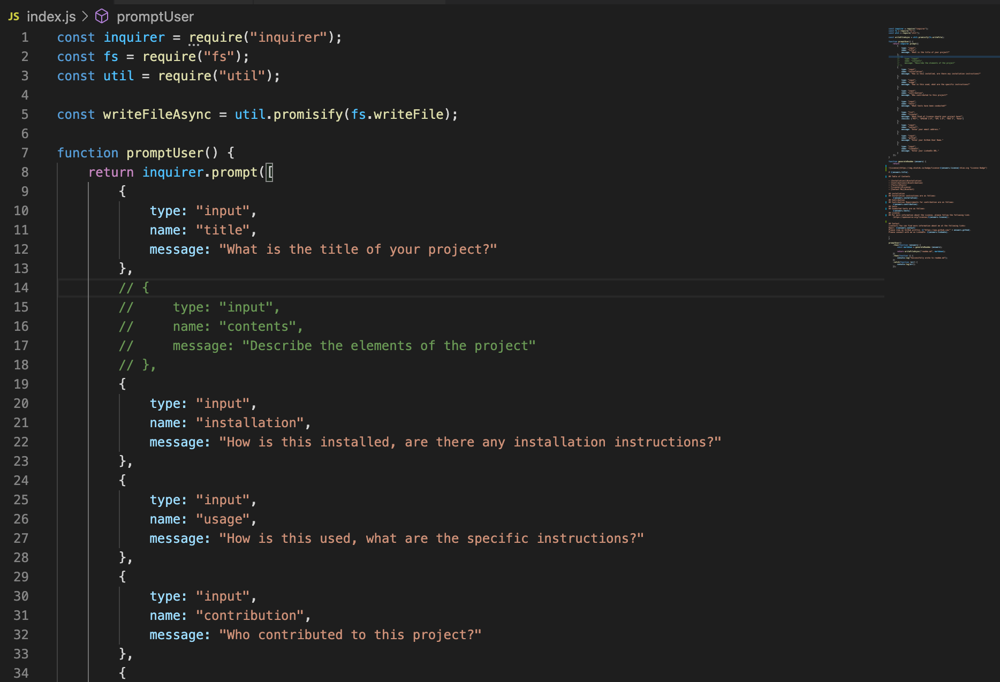

# README_gnator
README.md file generator.  You never knew you wanted one so badly.

10 SEP 2020
uploaded initial files; trying to understand formatting/syntax for creating .md files.

12 SEP 2020
Adding screenshots.

Adding one more screenshot.

Correcting Screen Shot names.

Uploading video.  

FINALLY DONE.
Creating the README Generator, or README_gnator, as we like to call it on the streets, was a new and interesting project for me.  The Command Line Interface (CLI) is a whole new universe for me, as I'm more used to pointy-clicky GUI stuff.  Also, this was my first time working with markup syntax.  Can you handle all this learning?  I can.

Here's what the code looks like:

Oh my, command line action follows:

Here's what the final product looks like.  Much nice.  So handsome.

If you'd like a copy of this README_gnator, just right click and save.  I won't stop you.  

One of the requirements was to load up a video showing that the CLI worked without any bugs.  Too easy.  Does anyone say 'bugs' anymore?  The original video from my iPhone was 151mb.  I compressed it down to around 40mb, but that was still too massive for GitHub.  I used an online compression site, and saved it to my Dropbox.  I'm sure they have all of my data now.  H@xx'd!

Good times.  I hope you enjoy the work as much as I enjoy writing these READ ME docs.  I mean it, I really enjoy it.

M
